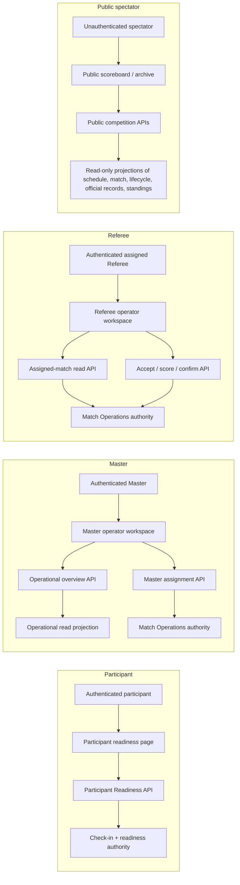
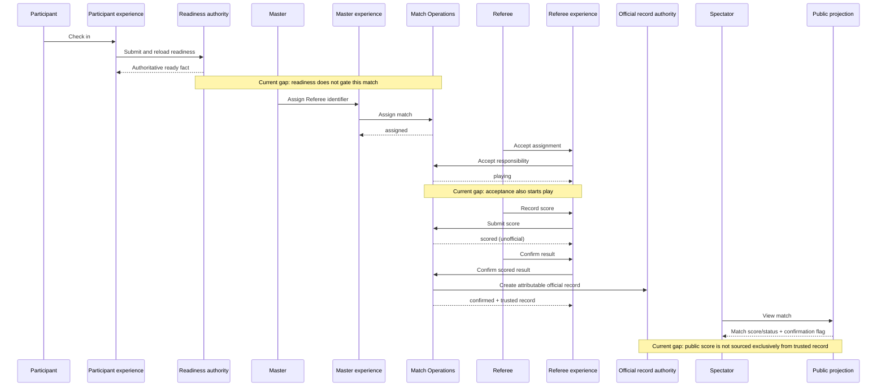

# M1 Match Operation Loop Boundary

| Field | Value |
|---|---|
| Status | Product boundary for PR #108 |
| Milestone | M1 — Product Engineering |
| Implementation status | Definition only |

## 1. Purpose

M1 delivers one coherent professional match operation loop:

> Participant Ready → Referee Assigned → Referee Accepted → Match Started →
> Score Recorded → Result Confirmed → Trusted Competition Record

This document defines what an operator and participant must be able to accomplish,
which existing backend authority answers each decision, and what remains incomplete.
It does **not** authorize backend, database, identity, authorization, or service work.

### Boundary constraints

* **Identity != Authority.** An authenticated actor session identifies the human.
  Readiness, assignment, execution, score, and confirmation rules remain decisions of
  their existing owning domains.
* **UI != Domain Authority.** Operator pages may present actions and authoritative
  responses; they may not infer, advance, or persist match state.
* **Experience Layer != Workflow Engine.** The experience connects a human to the
  existing APIs. It does not coordinate hidden transitions or become a new source of
  workflow truth.
* M1 introduces no identity system, authorization model, database model, platform
  layer, or service. Any later implementation must first be scoped independently.

## 2. Existing capability assessment

“Supported” below means a repository path exists. It does not mean the complete M1
experience is already delivered.

| Loop stage | Current support | Existing authority | Boundary assessment |
|---|---|---|---|
| Participant readiness | An authenticated participant can view readiness and check in. Check-in verifies competition registration and requires an accepted waiver before persisting `ready`. A competition-wide readiness list also exists. | Check-in service and Participant Readiness projection/domain | **Partial.** The fact is authoritative, but it is not presented in a match-specific call/start decision and is not enforced as a prerequisite to match execution. |
| Referee assignment | A Master can view the operational match overview and assign a referee identifier to an idle/upcoming match. | Match Operations `MatchOperation.assign` via the Master workflow API | **Partial.** Assignment and attribution exist, but the product provides a free-form identifier rather than an operational choice and does not show referee availability or eligibility. |
| Referee acceptance | An authenticated referee sees matches assigned to that session actor and can accept responsibility. Match Operations rejects another referee. | Match Operations `MatchOperation.acceptResponsibility` | **Supported as a transition, incomplete as a product step.** Acceptance currently changes the match directly from `assigned` to `playing`. |
| Match start / play | The match state includes `playing`; acceptance persists that state and its timestamp. Master live/operational views can display it. | Match Operations match state | **Gap against M1.** There is no distinct start action, start acknowledgement, or separate accepted/ready-to-start state. “Accepted” and “Started” cannot be observed independently. |
| Score recording | The assigned referee can submit two non-negative, non-tied integer scores while the match is `playing`; the result becomes `scored` and is not yet official. | Match Operations `MatchOperation.recordScore` | **Supported for the basic loop.** The referee experience exposes the action and reloads backend state. Sport-specific scoring, correction, and exception handling are outside this narrow capability. |
| Result confirmation | The assigned referee can confirm a scored result. Confirmation writes attributable confirmation data and an append-only official record, transactionally with match confirmation. | Match Operations confirmation domain and official-record persistence | **Supported for the happy path.** The current referee UI action does not provide a deliberate review summary or a visibly distinct confirmation receipt before/after commitment. |
| Public / trusted visibility | A public scoreboard shows schedule, court, mutable match status and score, plus whether an official record exists. A public completed-competition archive and an authenticated official-record read are also present. Standings derive only from official records. | Public projections read existing scheduling, match, lifecycle, and official-record authorities; result calculation reads official records | **Partial.** The public live scoreboard can display a recorded score before confirmation and only exposes a confirmation boolean, so spectators cannot clearly distinguish an unofficial score from the trusted record that supplies the official result. |

### Existing end-to-end happy path

The repository already contains the backend transitions for:

```text
idle/upcoming
  -> assigned (Master assigns Referee)
  -> playing (assigned Referee accepts)
  -> scored (assigned Referee records score)
  -> confirmed (assigned Referee confirms)
  -> official record (created during confirmation)
  -> standings/archive/public confirmation projections
```

The M1 product loop is not complete merely because those endpoints can be called.
In particular, readiness is adjacent rather than connected, referee acceptance is
conflated with starting play, and public score visibility is not consistently tied
to the official-record trust boundary.

## 3. Current workflow chain

The following map records the current chain, not a proposed orchestration layer.
Arrows mean “calls or reads”; the rightmost node owns the decision.



### Actor-by-actor map

| Human actor | Operator experience | Existing API | Domain authority and returned truth |
|---|---|---|---|
| Participant | Authenticated shell → readiness workspace; displays current readiness and check-in action | `GET .../participants/:participantId`; `POST .../check-in` | Registration lookup establishes that the participant belongs to the competition; check-in/waiver workflow owns the readiness fact. The page only refreshes that response. |
| Master | Authenticated shell → Master workspace; match overview and referee-ID assignment action | `GET /api/master-operations/:competitionId/matches`; `POST /api/master-workflow/:competitionId/matches/:matchId/assign`; live status read | Operational projections own visibility only. The Master adapter delegates assignment to Match Operations, whose state rules decide whether assignment succeeds. |
| Referee | Authenticated shell → assigned-match workspace; accept, score, and confirm actions | `GET /api/match-operations/:tournamentId/referees/:refereeId/matches`; referee workflow accept/score/confirm endpoints | Session actor supplies the referee identity; Match Operations verifies it against the stored assignment and owns every transition and official-record creation. |
| Public spectator | Public scoreboard during competition; public archive after completion | `GET /api/public/competitions/:competitionId/matches`; public archive endpoint | Read-only services project facts owned by scheduling, competition lifecycle, Match Operations, official records, and standings. The public UI owns no result truth. |

### Cross-actor hand-off map



## 4. Gaps

The distinction matters: product gaps describe human-visible behavior; technical
gaps describe why existing components do not yet provide that behavior. Neither list
is approval to implement a new layer or persistence model.

### 4.1 Missing product behavior

1. **One match-centred readiness picture.** The Master cannot see, at the decision
   point, that every participant in a specific match is ready, nor which participant
   prevents the call.
2. **A readiness prerequisite.** The professional loop does not prevent assignment,
   acceptance, or play when a match participant is not ready. The required gating
   point must be made explicit before implementation; M1 success requires play not to
   begin until all match participants are authoritatively ready.
3. **Operational referee selection.** The Master cannot choose from a clear set of
   appropriate referees with enough context to avoid blind/manual identifier entry.
   M1 only requires a clear assignable choice and current assignment outcome—not a
   workforce-management product.
4. **Separate acceptance and start.** A referee needs to acknowledge responsibility
   without claiming the match is already in play. Starting must be an explicit,
   observable action after readiness and acceptance.
5. **Clear next action and hand-off status.** Each experience must explain what is
   complete, what is blocking progress, who acts next, and which backend fact caused
   the status. It must not calculate a parallel local workflow state.
6. **Deliberate result review.** Before confirmation, the referee must see the score,
   participants/match identity, and the consequence that confirmation creates the
   trusted record. After success, the experience must show an authoritative receipt.
7. **Trust-labelled public result.** Spectators must see whether a displayed score is
   live/unofficial or confirmed/official. The trusted final score must come from the
   official record rather than merely pairing a mutable score with a boolean flag.
8. **Happy-path recovery.** Failed or stale actions must return the backend reason and
   refresh authoritative state so another actor's completed hand-off is recoverable
   without re-entering the whole workflow.

### 4.2 Missing technical infrastructure or integration

These are limitations of the current paths, not proposals for new infrastructure:

1. Existing readiness reads are competition/participant-centred; the Master match
   projection and Match Operations transition do not consume the authoritative
   readiness facts for the participants on that match.
2. The persisted operation vocabulary has `assigned` and `playing`, with acceptance
   directly producing `playing`; it has no independently observable accepted versus
   started contract.
3. The assignment boundary accepts an opaque referee string. No existing read
   contract supplies the Master experience with referee choices or operational
   suitability facts.
4. The public scoreboard reads `matches.score1/score2` regardless of confirmation.
   Although it detects official-record existence, it does not read the confirmed
   official score as the trusted public final.
5. Current APIs are independently usable, but there is no documented contract test
   proving the complete human sequence from participant check-in through the public
   trusted result, including blocked premature transitions and hand-offs between four
   experiences.
6. The naming of `competitionId` and `tournamentId` varies across adjacent routes.
   This does not require a new model, but M1 interaction contracts must consistently
   preserve the selected competition across workspace hand-offs.

### Explicit non-gaps for M1

M1 does **not** need a new identity provider, account/role system, authorization
framework, database model, workflow engine, event bus, orchestration service, or
general platform layer. Existing authenticated sessions identify actors, existing
domain rules remain authoritative, and existing persistence remains the source of
facts. Broader exception, dispute, correction, reassignment, and sport-rules flows are
future product boundaries unless required to make the single happy path safe.

## 5. M1 product boundary

### In scope

* One scheduled match with known participants in one active competition.
* Participant self-service readiness and match-specific visibility of that fact.
* Master visibility of readiness and assignment of one referee.
* Assigned referee acceptance followed by a distinct start action.
* Assigned referee score entry, deliberate review, and confirmation.
* Creation and retrieval of the attributable trusted competition record.
* Public distinction between unofficial live state and the official confirmed result.
* Backend errors and concurrent/stale state surfaced without UI-authored state.

### Out of scope

* Identity-provider implementation, actor provisioning, or session redesign.
* Roles, permissions, policy engines, or a replacement authorization boundary.
* New tables, records, aggregates, services, buses, or workflow/orchestration layers.
* Full referee workforce scheduling, payroll, certification, or availability planning.
* Disputes, appeals, result correction/versioning, cancellations, no-shows, replacement
  referees, multi-official crews, and sport-specific scoring variants.
* Tournament creation, draw generation, resource scheduling, and lifecycle redesign.

## 6. What a completed professional match operation looks like

A completed operation is not “all buttons were clicked.” It is a traceable sequence
of authoritative facts and intentional human hand-offs:

1. Every scheduled participant checks in and sees the backend-confirmed `ready` fact.
2. The Master opens the match and sees that all its participants are ready. If any are
   not ready, the interface names the blocker and the backend refuses premature play.
3. The Master selects a referee, submits the assignment, and sees the authoritative
   `assigned` result.
4. Only that authenticated, assigned referee sees the work and accepts responsibility.
   Acceptance is visible but does not itself claim the match has started.
5. The assigned referee explicitly starts the ready match. All relevant operator
   views then show that play is in progress from backend state.
6. The assigned referee records a valid final score. It is visibly **recorded but not
   official**, and it does not affect trusted standings as a confirmed result.
7. The referee reviews the match identity and score, then intentionally confirms it.
   Match Operations validates the transition and creates the attributable official
   record in the existing confirmation boundary.
8. The referee and Master see confirmation from authoritative responses. The public
   experience labels the official result and displays the confirmed score from the
   trusted record. Downstream standings/archive calculations consume that record.
9. At no point does session identity, UI state, accountability metadata, or an
   experience-layer sequence grant permission or substitute for a domain decision.

## 7. M1 acceptance criteria

### Participant Ready

* **M1-AC-01:** Given a registered participant with the required waiver, when the
  participant checks in, then the readiness authority returns and subsequently reads
  `ready` for that participant and competition.
* **M1-AC-02:** Given a match participant who is not ready, the match view identifies
  that participant as a blocker and the match cannot enter play.
* **M1-AC-03:** Readiness displayed to Participant and Master is reloaded from the
  existing readiness authority; neither experience creates a local ready state.

### Referee Assigned and Accepted

* **M1-AC-04:** Given a ready, startable match, the Master can select a referee and the
  backend-authoritative result identifies the assigned referee and assignment state.
* **M1-AC-05:** Only the authenticated referee whose actor ID matches the authoritative
  assignment can accept, record, or confirm that match; identity alone is insufficient.
* **M1-AC-06:** Referee acceptance is separately visible from match play and preserves
  the assignment; it does not automatically report that the match has started.

### Match Started

* **M1-AC-07:** The assigned, accepting referee has an explicit start action.
* **M1-AC-08:** Start succeeds only when the required participant readiness and referee
  responsibility facts are authoritative and current; otherwise the owning backend
  returns an actionable rejection.
* **M1-AC-09:** After start, Master and Referee experiences refresh and display the same
  backend-owned in-play state.

### Score Recorded and Result Confirmed

* **M1-AC-10:** During play, the assigned referee can submit a valid non-tied,
  non-negative integer score and receives the authoritative `scored` state.
* **M1-AC-11:** A recorded score is labelled unofficial and cannot contribute to
  official standings or appear as a trusted final result before confirmation.
* **M1-AC-12:** Before confirming, the referee sees the match, participants, score, and
  confirmation consequence and performs a distinct intentional action.
* **M1-AC-13:** Confirmation is rejected unless the authoritative match is scored and
  the actor is still the assigned referee.
* **M1-AC-14:** Successful confirmation atomically returns a confirmed match and an
  attributable official record containing match, score, referee/confirming actor,
  confirmation time, responsibility, and provenance already supported by the
  official-record boundary.

### Trusted Competition Record and visibility

* **M1-AC-15:** Referee and Master can observe the confirmed outcome by re-reading
  backend authority; a page success message alone is not completion.
* **M1-AC-16:** The public experience unmistakably differentiates in-progress or
  recorded-unconfirmed scores from an official result.
* **M1-AC-17:** The public official score, completed archive, and calculated standings
  agree with the trusted official record; unconfirmed mutable match scores are not
  presented as trusted facts.
* **M1-AC-18:** Refreshing, reopening, or moving between actor workspaces reconstructs
  the same current operation from existing APIs without a client-side workflow engine.

### Architectural compliance and delivery evidence

* **M1-AC-19:** Automated coverage demonstrates the complete happy path and negative
  cases for not-ready participants, wrong referee, premature start/score/confirmation,
  and unconfirmed public visibility.
* **M1-AC-20:** All mutation decisions are enforced by existing owning backend domains;
  authenticated identity and accountability metadata are inputs/attribution only.
* **M1-AC-21:** The delivered M1 scope adds no identity system, authorization system,
  database model, service, platform layer, or experience-owned workflow state.

## 8. Completion statement

M1 is complete when a real participant, Master, assigned referee, and spectator can
follow one match from readiness to a publicly recognizable official result, with each
handoff recoverable from authoritative backend facts and the final score traceable to
the existing trusted record. It is not complete if the path works only through direct
API calls, if acceptance silently means “playing,” if readiness is merely decorative,
or if the public cannot tell a recorded score from an official result.
