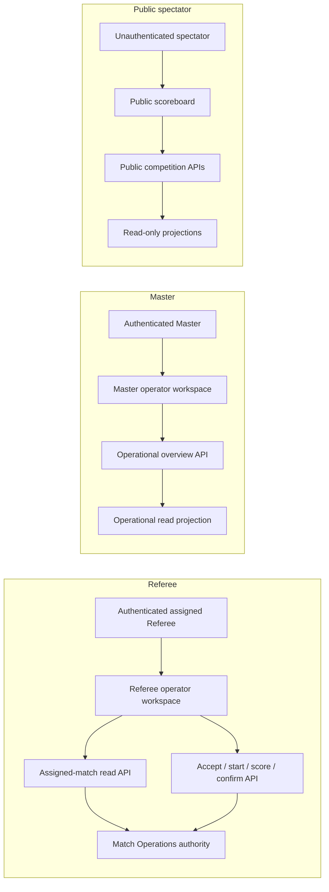
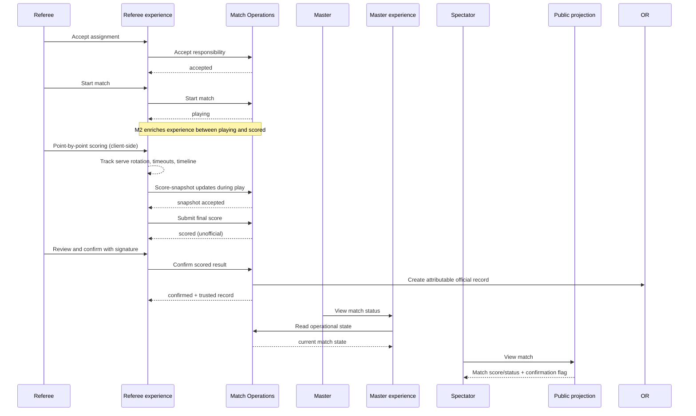

# M2 Referee Match Operation Experience Boundary

| Field | Value |
|---|---|
| Status | Product boundary definition |
| Milestone | M2 — Referee Match Operation Experience |
| Implementation status | Definition only |

## 1. Purpose

M2 delivers a professional, sport-aware referee match operation experience on top of the existing M1 backend authority:

> Pre-match Setup → Coin Flip & Stance → Serve/Receive Selection →
> Point-by-Point Scoring with Serve Rotation → Side-Switch Prompt →
> Timeout/Medical Timeout Timing → Game End → Multi-Game Match →
> Signature Confirmation → Trusted Result Submission

This document defines what a referee must be able to accomplish during a live match,
which existing backend authority answers each decision, and what remains incomplete.
It does **not** authorize backend, database, identity, authorization, or service work,
with one declared exception: static match-format configuration columns added to the
existing `matches` table (see section 5, "Declared database exception").

### Scoring-rule decision (M2)

Pickleball supports three mutually incompatible scoring/rotation models, verified
against Legacy behavior and official rules (USA Pickleball side-out rules, MLP
rally rules):

| Model | Rotation semantics | M2 decision |
|---|---|---|
| Rally scoring (每球得分制) | Every rally scores one point; the rally winner serves next; doubles partners swap left/right only when the serving side wins a rally; next server is determined by the serving team's score parity (even = right court, odd = left court) | **In scope. Default and only supported model.** |
| Sideout scoring (发球得分制) | Only the serving side scores; two consecutive serves per turn (1st serve → 2nd serve → side out); first-serve exception 0-0-2; server identity must be explicitly tracked and cannot be derived from score parity; three-number score call | **Deferred.** The `score_rule` field reserves the `sideout` value; the experience does not expose it. |
| Fixed-position doubles (固定站位) | Rally variant in which partners stay on their chosen court side for the entire game (no swap on serve win) | **Deferred.** |

Rally variants also excluded: winning-side freeze (score only while serving above a
threshold), half-rally scoring, and timed matches.

### Boundary constraints

* **Experience != Domain Authority.** The referee experience may present sport-aware
  actions (point, timeout, side-switch) and refresh authoritative state; it may not
  infer, advance, or persist match state independently of Match Operations.
* **Client State != Backend State.** Point-by-point history, serve rotation, timeout
  counters, and stance positions are maintained client-side for UX responsiveness.
  The backend remains the single source of truth for match state transitions.
* **Sport Rules != Backend Rules.** Scoring-variant behavior (rotation, serve
  tracking, win-condition evaluation) is an experience-layer concern. The backend
  stores match-format configuration as static facts and validates only final score
  submission; it does not evaluate sport rules during play.
* **Declared database exception.** M2 adds static match-format configuration
  columns to the **existing** `matches` table — `game_format` (1 = single game,
  3 = best-of-3), `score_rule` (`rally` only enabled in M2; `sideout` reserved),
  `target_score`, and `cap_score`. This is a column extension on an existing table:
  no new tables, records, aggregates, services, or workflow layers. These columns
  hold static configuration facts set before play; they are not match-state
  transitions and do not alter the state machine.
* M2 introduces no new identity system, authorization model, database model beyond
  the declared exception, platform layer, or service. All mutations flow through
  existing Match Operations endpoints.

## 2. Existing capability assessment

"Supported" below means a backend capability exists. It does not mean the complete
referee experience is already delivered.

| Experience stage | Current support | Existing authority | Boundary assessment |
|---|---|---|---|
| Task pull | Referee sees assigned matches via read API | Match Operations assigned-match read | **Supported.** The referee can view assigned work. |
| Match setup | No pre-match setup UI; no format configuration anywhere in the data path | Match Operations match state | **Gap.** No coin flip, stance selection, serve/receive selection, or format configuration in the experience. The `matches` table carries no format fields (`game_format`, `score_rule`, `target_score`, `cap_score`), so Master cannot designate match format today. |
| Pre-match ceremony | None | N/A | **Gap.** No warmup timer, coin flip, or side/serve selection UI. |
| Point-by-point scoring | Final score submission only | Match Operations `recordScore` | **Partial.** The backend accepts final scores but provides no point-by-point tracking, serve rotation, or timeline. |
| Serve rotation tracking | None | N/A | **Gap.** No experience-layer tracking of serve position, rally-based serve rotation, or current server display. |
| Side-switch prompt | None | N/A | **Gap.** No automatic prompt at half-score for court exchange. |
| Timeout management | None | N/A | **Gap.** No timeout request, timing, or per-team quota tracking. |
| Medical timeout | None | N/A | **Gap.** No medical timeout request or 15-minute timing. |
| Undo last point | None | N/A | **Gap.** No ability to retract the last point (critical for referee error recovery). |
| Multi-game match | None | N/A | **Gap.** No best-of-3 game tracking or inter-game setup. |
| Post-match confirmation | Simple confirm action | Match Operations confirmation domain | **Partial.** Confirmation exists but lacks deliberate review summary, signature capture, or visibly distinct confirmation receipt. |
| Live score sync | Public scoreboard reads match scores | Public projection | **Partial.** The public scoreboard can display scores but does not receive real-time updates from the referee experience. |

### Existing end-to-end happy path (M1)

The repository already contains the backend transitions for:

```text
assigned (Master assigns Referee)
  -> accepted (Referee accepts responsibility)
  -> playing (Referee starts match)
  -> scored (Referee records final score)
  -> confirmed (Referee confirms result)
  -> official record (created during confirmation)
```

M2 enriches the referee experience between `playing` and `scored` with sport-aware
operations, but does not change the backend state machine.

## 3. Current workflow chain

The following map records the current chain, not a proposed orchestration layer.
Arrows mean "calls or reads"; the rightmost node owns the decision.



### Actor-by-actor map

| Human actor | Operator experience | Existing API | Domain authority and returned truth |
|---|---|---|---|
| Referee | Authenticated shell → assigned-match workspace; accept, start, score, and confirm actions | `GET /api/match-operations/:tournamentId/referees/:refereeId/matches`; referee workflow accept/start/score/confirm endpoints | Session actor supplies the referee identity; Match Operations verifies it against the stored assignment and owns every transition and official-record creation. |
| Master | Authenticated shell → Master workspace; match overview and referee assignment actions | `GET /api/master-operations/:competitionId/matches`; live status read | Operational projections own visibility only. The Master adapter delegates assignment to Match Operations. |
| Public spectator | Public scoreboard during competition | `GET /api/public/competitions/:competitionId/matches` | Read-only services project facts owned by scheduling, competition lifecycle, Match Operations, and official records. |

### Cross-actor hand-off map



## 4. Gaps

The distinction matters: product gaps describe human-visible behavior; technical
gaps describe why existing components do not yet provide that behavior. Neither list
is approval to implement a new layer or persistence model.

### 4.1 Missing product behavior

1. **Pre-match setup ceremony.** The referee cannot configure match format
   (singles/doubles, scoring rule, target/cap scores), perform a coin flip, select
   sides, choose initial serve, or set doubles starting stance. These are essential
   for pickleball match operation.
2. **Master-designated match format.** Legacy Master creates tasks carrying format,
   scoring rule, target score, and cap score, which the referee terminal pre-fills
   into on-court setup (Legacy `master.html` task creation; `referee.html` task
   acceptance writes them into the setup form, with on-site override allowed).
   Modern has no equivalent: `matches` has no format columns and the referee work
   read path returns none, so the referee cannot receive Master-designated format.
   M2 restores this by the declared database exception plus a read-path extension
   (`mapRefereeWork` returns the format fields) and Master writing defaults at
   match generation/dispatch, following the Legacy practice
   (`rally`, target 21, cap 21).
3. **Point-by-point scoring with serve tracking.** The referee cannot record points
   individually with automatic rally-scoring serve rotation, current server display,
   win-condition evaluation (target score + 2-point lead, or cap-score forced end;
   `cap_score = 0` means no cap), and point timeline. Final score submission alone
   is insufficient for professional officiating.
4. **Side-switch prompt.** The referee receives no automatic prompt at half-score
   (e.g., first to 11 in a game to 21) to exchange courts. This is a mandatory
   pickleball rule.
5. **Timeout and medical timeout management.** The referee cannot request, time, or
   track per-team timeout quotas (one per game) or medical timeouts (one per match,
   15 minutes). These are standard referee operations.
6. **Undo last point.** The referee cannot retract the last point in case of scoring
   error. This is critical for error recovery during live play.
7. **Multi-game match tracking.** The referee cannot track best-of-3 games with
   inter-game setup (new serve selection, stance reset).
8. **Deliberate post-match confirmation with signature.** Before confirmation, the
   referee must see a match summary and provide a signature. After success, the
   experience must show an authoritative receipt.
9. **Live score sync to master and public.** The public scoreboard and master view
   should reflect real-time score updates during play, not just after final
   submission.

### 4.2 Missing technical infrastructure or integration

These are limitations of the current paths, not proposals for new infrastructure:

1. The referee experience has no client-side state management for point history,
   serve rotation, timeout counters, or stance positions.
2. The public scoreboard reads `matches.score1/score2` but does not receive real-time
   updates from the referee experience during play.
3. The current score submission accepts only final scores. Point-by-point data is
   not persisted (by design; it is experience-layer state).
4. There is no documented contract test proving the complete referee journey from
   pre-match setup through signature confirmation, including undo, timeout, and
   side-switch scenarios.

### Explicit non-gaps for M2

M2 does **not** need a new identity provider, authorization framework, database model,
workflow engine, event bus, orchestration service, or general platform layer. Existing
authenticated sessions identify actors, existing domain rules remain authoritative,
and existing persistence remains the source of facts. Sport-specific rule variants
beyond pickleball (e.g., tennis tiebreak, badminton rally scoring) are future product
boundaries. Within pickleball, sideout scoring, fixed-position doubles, and rally
variants (winning-side freeze, half-rally, timed matches) are also future boundaries;
M2 supports rally scoring only.

## 5. M2 product boundary

### In scope

* Pre-match setup: coin flip, side selection, serve selection, doubles stance, format
  configuration (singles/doubles, target/cap scores, scoring rule = rally only in
  M2; sideout and fixed-position are not offered in the UI).
* Master-designated match format delivery (following Legacy practice): Master writes
  `game_format`, `score_rule`, `target_score`, `cap_score` onto the match at
  generation/dispatch with defaults (`rally`, target 21, cap 21); the referee
  experience pre-fills on-court setup from these fields and may override them
  on-site before live play.
* Point-by-point scoring under rally scoring: automatic serve rotation (doubles
  partners swap left/right only when the serving side wins a rally; next server
  determined by the serving team's score parity), current server display, and
  win-condition evaluation (target score reached with a 2-point lead, or cap score
  forces the game end; `cap_score = 0` means no cap).
* Side-switch prompt at half-score with 60-second exchange timer.
* Timeout request and timing (per team, once per game).
* Medical timeout request and timing (once per match, 15 minutes).
* Undo last point capability.
* Multi-game match tracking (best-of-3) with inter-game setup.
* Post-match summary review and signature capture before confirmation.
* Live score sync to master and public scoreboard during play, implemented as a
  score-snapshot write through existing Match Operations score endpoints plus
  polling by scoreboard/master views; no new push channel or service.
* Client-side backup and recovery for interrupted matches (localStorage).

### Out of scope

* Backend state machine changes (accepted → playing → scored → confirmed remains).
* New tables, records, aggregates, services, buses, or workflow/orchestration
  layers. (Column extensions on the existing `matches` table for static
  match-format configuration are the sole declared exception; see section 1.)
* Sideout scoring (发球得分制): deferred. The `score_rule` column reserves the
  value; the experience exposes rally only.
* Fixed-position doubles (固定站位): deferred.
* Rally-scoring variants: winning-side freeze, half-rally scoring, timed matches.
* Identity-provider implementation, actor provisioning, or session redesign.
* Roles, permissions, policy engines, or a replacement authorization boundary.
* Sport-specific scoring variants beyond pickleball (tennis, badminton, table tennis)
  and scoring-rule variants within pickleball not listed in scope.
* Disputes, appeals, result correction/versioning, cancellations, no-shows, or
  replacement referees.
* Tournament creation, draw generation, resource scheduling, and lifecycle redesign.
* Communications such as notices, referee/participant messages, or broadcast links.
* Full referee workforce scheduling, payroll, certification, or availability planning.

## 6. What a completed professional match operation looks like

A completed operation is not "all buttons were clicked." It is a traceable sequence
of authoritative facts and intentional human hand-offs:

1. The assigned referee opens the match and sees pre-match setup: coin flip, side
   selection, serve selection, and (for doubles) starting stance.
2. Match-format configuration is designated by Master (format, scoring rule, target
   score, cap score) and pre-filled into the referee's on-court setup; the referee
   confirms or overrides it. The experience enters pre-match ceremony.
3. The referee performs warmup timer (optional), coin flip, and final side/serve
   confirmation. The experience enters live play.
4. During play, the referee records points individually. Under rally scoring, the
   experience tracks serve rotation, displays current server, evaluates win
   conditions, and maintains a point timeline.
5. At half-score, the experience prompts side-switch with a 60-second exchange timer.
6. Either team may request timeout (once per game) or medical timeout (once per match,
   15 minutes). The experience times the interruption and resumes play.
7. The referee may undo the last point in case of scoring error.
8. When a game ends (target score + 2-point lead, or cap score), the experience
   records the game result. For best-of-3, the referee sets up the next game.
9. When the match ends (final game won), the referee reviews the match summary and
   provides a signature. The experience submits the final score and confirmation.
10. Match Operations validates the transition and creates the attributable official
    record. The referee and master see confirmation from authoritative responses.
11. During play, the public scoreboard and master view reflect real-time score updates
    from the referee experience.
12. At no point does session identity, UI state, accountability metadata, or an
    experience-layer sequence grant permission or substitute for a domain decision.

## 7. M2 acceptance criteria

### Pre-match Setup

* **M2-AC-01:** Given an assigned, accepted match, the referee can configure match
  format (singles/doubles, target/cap scores; scoring rule = rally only) and perform
  pre-match setup (coin flip, side selection, serve selection, doubles stance).
* **M2-AC-01a:** Match-format fields designated by Master are pre-filled into the
  referee's on-court setup; the referee can override them on-site before live play.
* **M2-AC-01b:** When Master has not designated format, defaults apply (`rally`,
  target 21, cap 21), following Legacy practice.
* **M2-AC-02:** The experience validates that all required setup fields are complete
  before entering live play.

### Point-by-Point Scoring

* **M2-AC-03:** During play, the referee can record points individually. Under rally
  scoring, the experience tracks serve rotation: doubles partners swap left/right
  only when the serving side wins a rally, and the next server is determined by the
  serving team's score parity (even = right court, odd = left court). Sideout
  rotation is not implemented in M2.
* **M2-AC-04:** The experience displays the current server and serve position (for
  doubles) at all times.
* **M2-AC-05:** The experience maintains a point timeline showing the sequence of
  points won by each team.
* **M2-AC-05a:** Win-condition evaluation ends a game when the leading side reaches
  the target score with at least a 2-point lead, or when the cap score is reached
  (forced end); `cap_score = 0` means no cap.

### Side-Switch and Timeouts

* **M2-AC-06:** At half-score (e.g., first to 11 in a game to 21), the experience
  prompts side-switch and starts a 60-second exchange timer.
* **M2-AC-07:** Either team may request timeout (once per game). The experience times
  the timeout (60 seconds) and resumes play.
* **M2-AC-08:** Either team may request medical timeout (once per match, 15 minutes).
  The experience times the medical timeout and resumes play.

### Undo and Multi-Game

* **M2-AC-09:** The referee can undo the last point. The experience reverts score,
  serve rotation, and timeline to the previous state.
* **M2-AC-10:** For best-of-3 matches, when a game ends, the experience records the
  game result and allows setup for the next game (new serve selection, stance reset).

### Post-Match Confirmation

* **M2-AC-11:** When the match ends, the referee sees a match summary (final score,
  game results, participants, match identity) and provides a signature.
* **M2-AC-12:** Confirmation is rejected unless the authoritative match is scored and
  the actor is still the assigned referee.
* **M2-AC-13:** Successful confirmation atomically returns a confirmed match and an
  attributable official record containing match, score, referee/confirming actor,
  confirmation time, responsibility, and provenance already supported by the
  official-record boundary.

### Live Score Sync

* **M2-AC-14:** During play, the public scoreboard and master view reflect score
  updates from the referee experience (score-snapshot writes plus polling; no new
  push channel or service).
* **M2-AC-15:** The public experience unmistakably differentiates in-progress or
  recorded-unconfirmed scores from an official result.

### Architectural compliance and delivery evidence

* **M2-AC-16:** Automated coverage demonstrates the complete happy path and negative
  cases for invalid setup, premature confirmation, and undo scenarios.
* **M2-AC-17:** All mutation decisions are enforced by existing owning backend domains;
  authenticated identity and accountability metadata are inputs/attribution only.
* **M2-AC-18:** The delivered M2 scope adds no identity system, authorization system,
  database model, service, platform layer, or experience-owned workflow state, except
  the declared static match-format configuration columns on the existing `matches`
  table; and the `matches.status` enum value set is unchanged.
* **M2-AC-19:** Client-side state (point history, serve rotation, timeout counters)
  is maintained for UX responsiveness but is not persisted as backend truth.
* **M2-AC-20:** Automated coverage demonstrates the three win-condition branches
  (target + 2-point lead, cap-score forced end, no cap) and the rally serve-rotation
  rules (partner swap on serve win, parity-based next server), including undo
  restoring rotation state.

## 8. Completion statement

M2 is complete when a real assigned referee can follow one match from pre-match setup
through signature confirmation, with point-by-point scoring, serve rotation, side-switch
prompts, timeout management, undo capability, and live score sync. It is not complete
if the path works only through final score submission, if serve rotation is manual,
if side-switch is not prompted, if timeouts cannot be timed, if undo is unavailable,
or if the public cannot see real-time score updates during play.

---

**Status:** Product boundary definition; documentation only
